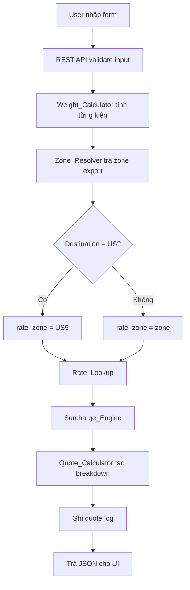

# 03. Kiến trúc hệ thống

## 1. Kiểu kiến trúc

Plugin WordPress monolith, chia module rõ ràng theo nghiệp vụ. Không dùng post/meta cho dữ liệu giá vì bảng giá và zone là dữ liệu dạng ma trận, cần lookup nhanh và dễ versioning.

## 2. Thành phần chính

```text
allship-ups-quote/
  allship-ups-quote.php
  includes/
    class-plugin.php
    class-activator.php
    class-rate-card-repository.php
    class-country-repository.php
    class-zone-repository.php
    class-rate-repository.php
    class-service-availability-manager.php
    class-excel-importer.php
    class-zone-importer.php
    class-rate-importer.php
    class-weight-calculator.php
    class-zone-resolver.php
    class-rate-lookup.php
    class-surcharge-engine.php
    class-quote-calculator.php
    class-rest-controller.php
    class-shortcode.php
    config/
      service-registry.php
  admin/
    class-admin-menu.php
    views/import.php
    views/settings.php
    views/rate-cards.php
    views/quote-logs.php
  public/
    assets/js/quote-form.js
    assets/css/quote-form.css
    views/quote-form.php
  vendor/
    phpoffice/phpspreadsheet/
```

## 3. Module nghiệp vụ

| Module | Trách nhiệm |
|---|---|
| `Service_Availability_Manager` | Xác định services khả dụng theo direction + rate card data + admin toggle. |
| `Excel_Importer` | Điều phối đọc workbook, validate, tạo bản import preview. |
| `Rate_Importer` | Parse sheet `VN from 20.Aug.2026` thành rate rows với naming mới. |
| `Zone_Importer` | Parse `IATA.xlsx` hoặc sheet `Zn` thành country/zone maps. |
| `Weight_Calculator` | Tính dim weight, chargeable weight, rounding từng kiện. |
| `Zone_Resolver` | Tìm zone theo direction/service/destination và áp dụng US5 override. |
| `Rate_Lookup` | Tìm dòng giá theo rate group, zone, chargeable weight. |
| `Surcharge_Engine` | Extension point cho VAT/FSC/Surge/phụ phí. Phase 1 mặc định off. |
| `Quote_Calculator` | Orchestrator toàn bộ luồng báo giá. |
| `Rest_Controller` | Endpoints: `/calculate`, `/countries`, `/services`, `/directions`. |
| `Shortcode` | Render `[ups_quote_form]`. |

## 4. Luồng báo giá



## 5. Pseudocode quote calculator

```php
public function calculate(array $input): QuoteResult {
    $direction = 'export'; // Phase 1 fixed
    $serviceCode = $input['service_code'];
    $destination = $this->countries->findByIata($input['destination_iata']);

    $pieces = $this->weightCalculator->calculatePieces(
        $input['pieces'],
        $this->settings->getDimDivisor(),
        $this->settings->getRoundingStep()
    );

    $chargeableWeight = array_sum(array_column($pieces, 'chargeable_weight'));

    $zoneResult = $this->zoneResolver->resolve(
        $direction,
        $serviceCode,
        $destination->iata_code
    );

    $rateGroup = $this->mapRateGroup($serviceCode, $input['shipment_type'] ?? null);

    $baseRate = $this->rateLookup->findPrice(
        $this->rateCards->activeId(),
        $rateGroup,
        $zoneResult->rate_zone,
        $chargeableWeight,
        $input['envelope'] ?? false
    );

    $fees = $this->surchargeEngine->calculate($baseRate, $input, $pieces);

    $result = QuoteResult::from($pieces, $zoneResult, $baseRate, $fees);
    $this->quoteLogs->insert($input, $result);

    return $result;
}
```

## 6. Error handling

| Trường hợp | HTTP | Mã lỗi | Nội dung |
|---|---:|---|---|
| Service chưa mở | 422 | `SERVICE_NOT_SUPPORTED` | Dịch vụ chưa hỗ trợ trong phase 1. |
| Destination không tồn tại | 422 | `UNKNOWN_DESTINATION` | Không tìm thấy điểm đến. |
| Không có zone | 422 | `LANE_NOT_AVAILABLE` | Tuyến này không hỗ trợ dịch vụ đã chọn. |
| Không có dòng giá | 422 | `RATE_NOT_FOUND` | Không tìm thấy giá cho cân/zone. |
| File import sai cấu trúc | 400 | `INVALID_RATE_FILE` | Không tìm thấy bảng/cột bắt buộc. |
| Server lỗi | 500 | `QUOTE_INTERNAL_ERROR` | Lỗi hệ thống, đã ghi log. |

## 7. Bảo mật

- Public quote endpoint dùng nonce nếu gọi từ shortcode.
- Admin import cần capability `manage_options` hoặc capability riêng `manage_ups_rates`.
- Validate mọi input server-side, không tin dữ liệu từ JS.
- File upload chỉ cho `.xlsx`, kiểm tra MIME và kích thước.
- Không lưu file upload public trực tiếp; lưu trong thư mục plugin/private hoặc chỉ lưu hash + metadata.
- Escape output trong admin và public view theo chuẩn WordPress.

## 8. Hiệu năng

Dữ liệu nhỏ, lookup có thể xử lý tốt bằng MySQL custom tables:

- Countries khoảng 250 dòng.
- Zone map khoảng vài nghìn dòng.
- Rate rows khoảng vài trăm dòng mỗi rate card.
- Quote logs tăng theo traffic, cần index `created_at`, `destination_iata`, `service_code`.

Nên cache:

- Active rate card id.
- Country list cho dropdown.
- Settings.

Không cần microservice hoặc queue trong phase 1.

## 9. Khả năng mở rộng

Thiết kế hiện tại mở sẵn cho:

- Bật chiều `Import` bằng toggle trong Rate Card detail page.
- Thêm bảng giá cho `EXW`, `XPR`, `WXP` — chỉ cần import data + admin bật, không cần sửa code (template rate group đã sẵn).
- Tích hợp UPS API để tạo shipment.
- Thêm phụ phí động theo lịch.
- Thêm nhiều origin market nếu sau này không chỉ `VN`.
- `SERVICE_REGISTRY` config cho phép thêm service mới không cần sửa logic.
