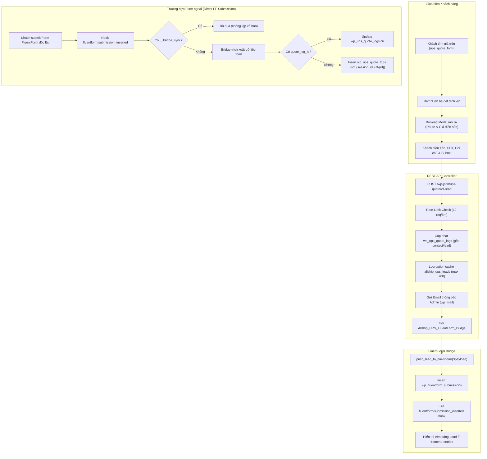

# 14. Tích hợp FluentForm & Đồng bộ Lead Báo giá UPS

Tài liệu đặc tả chi tiết kiến trúc tích hợp 2 chiều giữa Plugin **Allship UPS Quote**, **FluentForm** (Core/Pro), và addon hiển thị danh sách **ff-frontend-entries**.

---

## 1. Mục tiêu và Kiến trúc Tổng quan (Dual-Storage Architecture)

Hệ thống cho phép khách hàng nhận báo giá trực tuyến, sau đó đặt dịch vụ ngay trên Booking Modal hoặc qua form FluentForm độc lập. Mọi dữ liệu đặt dịch vụ đều được lưu trữ đồng thời vào 2 hệ thống:

1. **Bảng Lead của FluentForm (`wp_fluentform_submissions`)**:
   - Nhân viên quản lý lead trên giao diện frontend qua plugin `ff-frontend-entries` (hoặc WP Admin FluentForm).
   - Cột **Dịch vụ quan tâm** hiển thị 1 trong 18 tên dịch vụ chuẩn hóa quốc tế.
   - Cột **Nội dung chi tiết** (`message`) hiển thị đầy đủ thông tin hành trình, giá tạm tính, ghi chú khách hàng, và chi tiết từng kiện hàng (kích thước, cân nặng thực tế, cân nặng quy đổi thể tích).

2. **Bảng Lịch sử Báo giá UPS (`wp_ups_quote_logs`)**:
   - Lưu trữ bản ghi báo giá chi tiết, phục vụ thống kê sản lượng, phân tích tỷ lệ chốt đơn, và xuất báo cáo CSV/Excel.
   - Cột `breakdown_json` tự động cập nhật object `contact` hoặc `lead` chứa họ tên, số điện thoại, email, ghi chú và `ff_entry_id` liên kết trực tiếp với bản ghi bên FluentForm.



---

## 2. Chuẩn Hóa Cột Dịch Vụ (`service`) Theo 18 Phân Loại

Để bảng danh sách lead trên `ff-frontend-entries` hiển thị trực quan và lọc chính xác, trường `service` được JavaScript và Bridge tự động chuẩn hóa theo quy tắc:

### 2.1. Danh mục 18 dịch vụ chuẩn hóa

| # | Chiều | Mã dịch vụ | Loại hàng (Shipment Type) | Tên hiển thị chuẩn (`service`) |
|---|---|---|---|---|
| 1 | Export | `EXW` | Document | `Express Early Document (EXW Doc) - Export` |
| 2 | Export | `EXW` | Non-Document | `Express Early Non-Document (EXW Non-Doc) - Export` |
| 3 | Export | `XPR` | Document | `Express Plus Document (XPR Doc) - Export` |
| 4 | Export | `XPR` | Non-Document | `Express Plus Non-Document (XPR Non-Doc) - Export` |
| 5 | Export | `WXS` | Document | `Express Saver Document (WXS Doc) - Export` |
| 6 | Export | `WXS` | Non-Document | `Express Saver Non-Document (WXS Non-Doc) - Export` |
| 7 | Export | `XPD` | Mặc định | `Expedited (XPD) - Export` |
| 8 | Export | `WXP` | Mặc định | `Express Freight (WXP) - Export` |
| 9 | Export | `WFM` | Mặc định | `Freight Midday (WFM) - Export` |
| 10 | Import | `EXW` | Document | `Express Early Document (EXW Doc) - Import` |
| 11 | Import | `EXW` | Non-Document | `Express Early Non-Document (EXW Non-Doc) - Import` |
| 12 | Import | `XPR` | Document | `Express Plus Document (XPR Doc) - Import` |
| 13 | Import | `XPR` | Non-Document | `Express Plus Non-Document (XPR Non-Doc) - Import` |
| 14 | Import | `WXS` | Document | `Express Saver Document (WXS Doc) - Import` |
| 15 | Import | `WXS` | Non-Document | `Express Saver Non-Document (WXS Non-Doc) - Import` |
| 16 | Import | `XPD` | Mặc định | `Expedited (XPD) - Import` |
| 17 | Import | `WXP` | Mặc định | `Express Freight (WXP) - Import` |
| 18 | Import | `WFM` | Mặc định | `Freight Midday (WFM) - Import` |

### 2.2. Thuật toán mapping (`getStandardServiceName`)
Trong `public/assets/js/quote-form.js`:
```javascript
function getStandardServiceName(serviceCode, direction, shipmentType) {
  const isExport = direction === 'export';
  const suffix = isExport ? 'Export' : 'Import';
  const isDoc = String(shipmentType).toLowerCase().includes('doc') && !String(shipmentType).toLowerCase().includes('non');

  switch (serviceCode) {
    case 'EXW':
      return isDoc ? `Express Early Document (EXW Doc) - ${suffix}` : `Express Early Non-Document (EXW Non-Doc) - ${suffix}`;
    case 'XPR':
      return isDoc ? `Express Plus Document (XPR Doc) - ${suffix}` : `Express Plus Non-Document (XPR Non-Doc) - ${suffix}`;
    case 'WXS':
      return isDoc ? `Express Saver Document (WXS Doc) - ${suffix}` : `Express Saver Non-Document (WXS Non-Doc) - ${suffix}`;
    case 'XPD':
      return `Expedited (XPD) - ${suffix}`;
    case 'WXP':
      return `Express Freight (WXP) - ${suffix}`;
    case 'WFM':
      return `Freight Midday (WFM) - ${suffix}`;
    default:
      return `${serviceCode} - ${suffix}`;
  }
}
```

---

## 3. Định Dạng Nội Dung Đa Kiện Hàng Trong `ff-frontend-entries`

Trong giao diện `ff-frontend-entries`:
- Khung **Nội dung chi tiết** lấy nội dung từ trường `message` (`ghi_chu`).
- Khi báo giá có 1 hoặc nhiều kiện hàng, hàm `buildBookingDetailedMessage()` kết hợp ghi chú cá nhân của khách hàng với bảng kê chi tiết toàn bộ các kiện hàng theo định dạng danh sách (list):

```text
[Ghi chú khách hàng]:
Giao hàng giờ hành chính, cần hỗ trợ đóng gói cẩn thận.

--------------------------------------
THÔNG TIN BÁO GIÁ UPS:
• Tuyến: Xuất khẩu (TP. Hồ Chí Minh ➔ United States (US))
• Dịch vụ: Express Saver Non-Document (WXS Non-Doc) - Export
• Trọng lượng tính cước: 12.50 kg
• Tạm tính: 3.450.000 VND
• Chi tiết các kiện hàng (3 kiện):
  - Kiện #1: 1 kiện/thùng, 4.0 kg/kiện, KT: 30 × 20 × 15 cm (TLTT: 1.64 kg)
  - Kiện #2: 2 kiện/thùng, 3.0 kg/kiện, KT: 40 × 30 × 25 cm (TLTT: 5.45 kg)
  - Kiện #3: 1 kiện/thùng, 3.0 kg/kiện, KT: 35 × 25 × 20 cm (TLTT: 3.18 kg)
```

Nhân viên quản lý mở popup chi tiết của Lead trong `ff-frontend-entries` sẽ thấy đầy đủ thông tin để tư vấn ngay mà không cần tra soát lại database.

---

## 4. Ma Trận Mapping Dữ Liệu (Field Mapping Matrix)

| Trường Lead Payload | Vai trò trong `ff-frontend-entries` / `wp_fluentform_submissions` | Vai trò trong `wp_ups_quote_logs` |
|---|---|---|
| `name` | Cột **Họ tên** khách hàng | Lưu vào `breakdown_json.contact.name` |
| `phone` | Cột **Số điện thoại** (click-to-call) | Lưu vào `breakdown_json.contact.phone` |
| `email` | Cột **Email** | Lưu vào `breakdown_json.contact.email` |
| `service` | Cột & Badge **Dịch vụ quan tâm** (1 trong 18 tên chuẩn) | Tham chiếu đối soát `service_code` |
| `hidden_service_name` | Nhãn dịch vụ cấp cao (`Dịch vụ chuyển phát quốc tế UPS - Xuất khẩu`) | Nhãn phân loại dịch vụ |
| `message` | Khung **Nội dung chi tiết** (Ghi chú + danh sách đa kiện) | Lưu trữ nội dung trao đổi ban đầu |
| `notes` | Ghi chú gốc người dùng nhập | Lưu vào `breakdown_json.contact.notes` |
| `direction` | Trường ẩn (`export` / `import`) | Cột `direction` |
| `direction_label` | Nhãn chiều (`Xuất khẩu` / `Nhập khẩu`) | Ghi chú bổ sung |
| `origin` | Nơi gửi hàng | Cột `origin_province` |
| `destination` | Nơi nhận hàng (Địa chỉ, Thành phố, Bang, Nước) | Cột `destination_address` |
| `destination_iata` | Mã quốc gia đến (2 ký tự IATA) | Cột `destination_iata` |
| `service_code` | Mã dịch vụ UPS (`WXS`, `XPD`, `WFM`, v.v.) | Cột `service_code` |
| `chargeable_weight` | Trọng lượng tính cước định dạng chuỗi (`12.50 kg`) | Tham chiếu cột `chargeable_weight_kg` |
| `total_price` | Giá cước định dạng chuỗi (`3.450.000 VND`) | Tham chiếu cột `total_price_vnd` |
| `total_price_raw` | Giá cước số nguyên (VND) | Cột `total_price_vnd` |
| `quote_log_id` | ID bản ghi tính cước UPS đã ghi trước đó | Khóa chính ID để UPDATE bản ghi log cũ |
| `route_summary` | Tóm tắt hành trình (`TP. Hồ Chí Minh ➔ US`) | Phục vụ hiển thị nhanh |
| `pieces_json` | Chuỗi JSON toàn bộ mảng kiện hàng | Cột `pieces_json` |
| `hidden_source` | Nguồn tạo lead (`ups_quote_booking_modal`) | Nhận diện nguồn lead của hệ thống UPS |
| `__bridge_sync` | Cờ nội bộ ngăn chặn đệ quy vô hạn | Không lưu |

---

## 5. Cấu Trúc Class `Allship_UPS_FluentForm_Bridge`

File: `includes/class-fluentform-bridge.php`

### 5.1. Khởi tạo Hook
```php
public function init() {
    add_action( 'fluentform/submission_inserted', [ $this, 'on_submission_inserted' ], 20, 3 );
}
```

### 5.2. Đồng bộ từ REST API sang FluentForm (`push_lead_to_fluentform`)
- Kiểm tra sự tồn tại của bảng `{prefix}fluentform_submissions`.
- Lấy `form_id` được chỉ định qua setting `allship_ups_fluentform_id` (hoặc auto-detect form có tiêu đề chứa chữ "UPS" hoặc "Báo Giá").
- Tính toán số thứ tự tự tăng `serial_number`.
- Nhận diện thiết bị (`device`: desktop, mobile, tablet) và trình duyệt (`browser`: Chrome, Safari, Firefox, Edge, Opera).
- Encode dữ liệu thành JSON theo chuẩn UTF-8 Unicode (`JSON_UNESCAPED_UNICODE`).
- Thực hiện INSERT vào bảng `{prefix}fluentform_submissions`.
- Kích hoạt action hook của FluentForm: `do_action('fluentform/submission_inserted', $entry_id, $form_data, $form_obj)`.

### 5.3. Đồng bộ ngược từ FluentForm Hook sang Quote Logs (`on_submission_inserted`)
- Bỏ qua nếu có flag `$form_data['__bridge_sync'] === true`.
- Nhận diện lead UPS qua `hidden_source`, `service_code`, `quote_log_id`, hoặc tiêu đề form.
- Nếu có `quote_log_id`: Update `breakdown_json` của log hiện có với thông tin liên hệ và `ff_entry_id`.
- Nếu chưa có log (khách điền form ngoài): Tạo bản ghi mới trong `wp_ups_quote_logs` với `session_id = 'ff-' . $insert_id`.

---

## 6. Mẫu Form JSON Import (`fluentform-quote-template.json`)

Vị trí file: `data/fluentform-quote-template.json`

File mẫu có thể import trực tiếp vào WordPress Admin thông qua menu: **Fluent Forms ➔ Tools ➔ Import Forms**.

Cấu trúc gồm:
- **Tên form**: `Yêu Cầu Báo Giá & Đặt Dịch Vụ UPS`
- **Các trường nhập liệu công khai**:
  - `name` (Họ và tên - Required)
  - `phone` (Số điện thoại - Required, numeric validation)
  - `notes` (Ghi chú về hàng hóa)
- **Các trường ẩn (Hidden Fields)**:
  - `service`
  - `hidden_service_name`
  - `message`
  - `direction`
  - `direction_label`
  - `origin`
  - `destination`
  - `destination_iata`
  - `service_code`
  - `service_name`
  - `chargeable_weight`
  - `total_price`
  - `total_price_raw`
  - `quote_log_id`
  - `route_summary`
  - `pieces_json`
  - `hidden_source`

---

## 7. Cấu Hình Admin & Tự Động Nhận Diện Form

1. **Cấu hình chỉ định Form ID**:
   - Menu: **UPS Rate Calculator ➔ Settings ➔ Tab Advanced**.
   - Trường: `FluentForm Lead Form ID` (key: `fluentform_id`).
   - Admin có thể điền ID cụ thể của form muốn nhận lead.

2. **Cơ chế Fallback Auto-Detection**:
   - Nếu `fluentform_id` để trống (bằng `0`): Bridge tự động query bảng `{prefix}fluentform_forms` tìm form đang publish có tiêu đề chứa từ khóa `UPS` hoặc `Báo Giá`.
   - Nếu vẫn không tìm thấy: Fallback về form published mới nhất, hoặc form ID `1`.

---

## 8. Kiểm Thử và Bảo Đảm Chất Lượng (Test Suite)

File kiểm thử tích hợp: `tests/test-fluentform-integration.php`

Bộ kiểm thử thực hiện 7 nhóm test tự động với mock database:
1. **Test 1**: Template JSON tồn tại và hợp lệ theo cấu trúc FluentForm.
2. **Test 2**: 18 tên dịch vụ chuẩn hóa được định nghĩa và map chính xác cho cả Export và Import.
3. **Test 3**: Hook `fluentform/submission_inserted` được đăng ký chuẩn xác.
4. **Test 4**: Chống lặp đệ quy vô hạn khi có cờ `__bridge_sync`.
5. **Test 5**: Cập nhật chính xác `quote_log_id` và gắn `ff_entry_id` vào `breakdown_json`.
6. **Test 6**: Phương thức `push_lead_to_fluentform` bridge thành công REST lead vào bảng submissions với nội dung đa kiện hàng định dạng list.
7. **Test 7**: Setting `fluentform_id` được đăng ký, sanitize kiểu số nguyên (`absint`), và lưu trữ đúng trong settings.
